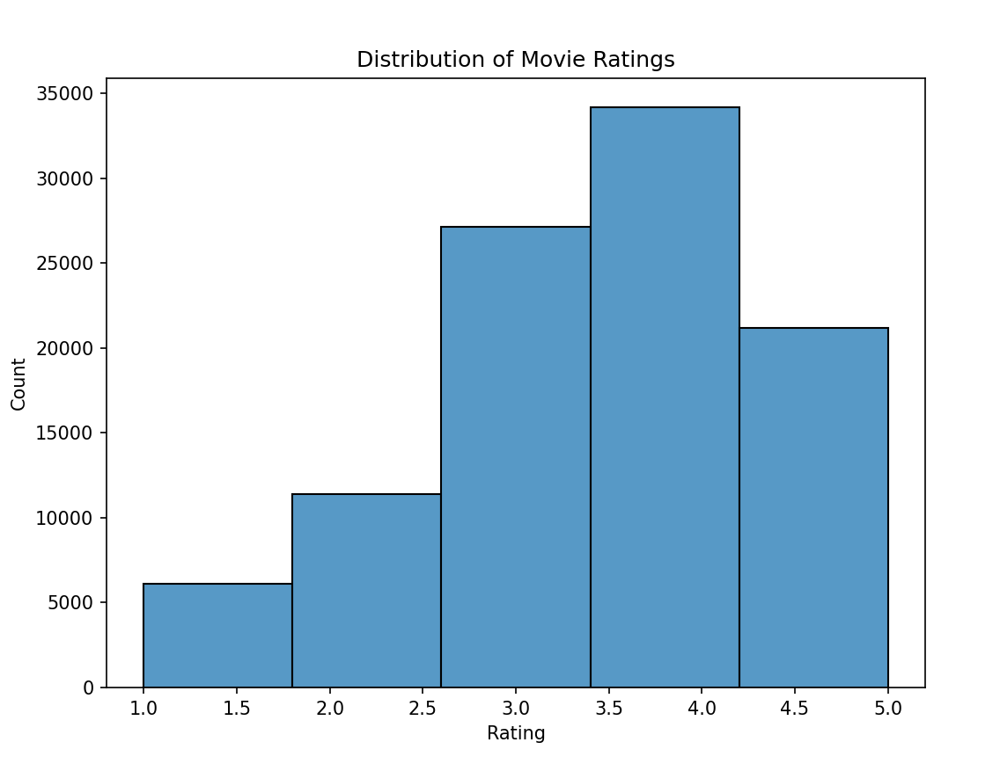
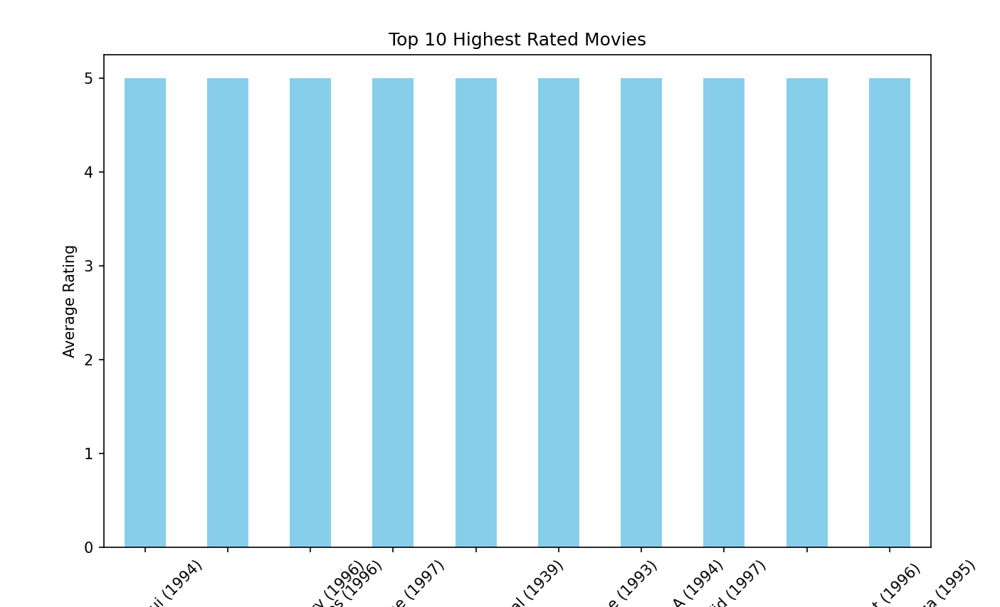

# Movie Ratings Analysis 🎬📊

This project performs an analysis of movie ratings using the [MovieLens 100K Dataset](https://grouplens.org/datasets/movielens/100k/). It includes data cleaning, merging datasets, generating insights such as top-rated movies, and visualizing the distribution of ratings. The results are exported to an Excel file that includes the merged dataset, histogram data, and top-rated movies.

## Table of Contents
- [Project Overview](#project-overview)
- [Dataset](#dataset)
- [Installation](#installation)
- [How to Run](#how-to-run)
- [Features](#features)
- [Results](#results)
- [Contributing](#contributing)
- [License](#license)

## Project Overview
The purpose of this project is to:
1. Analyze movie ratings from the MovieLens 100K dataset.
2. Merge movie titles and rating data to extract insights.
3. Generate a histogram to show the distribution of movie ratings.
4. Identify the top 10 highest-rated movies.
5. Export the analysis results into an Excel file, including:
   - The merged dataset of movie ratings and titles.
   - The histogram data (bins and counts).
   - A list of the top 10 highest-rated movies.

## Dataset 📈
The dataset used for this project is the **MovieLens 100K Dataset**, which contains 100,000 ratings from 1,000 users on 1,700 movies. The dataset files used are:
- `u.data`: Contains the user ratings for movies.
- `u.item`: Contains the movie titles and other information.

Download the dataset from [here](https://grouplens.org/datasets/movielens/100k/).

## Installation 🏗️

### Prerequisites
- **Python 3.x**: Make sure you have Python installed. You can download it from [python.org](https://www.python.org/downloads/).
- **Virtual Environment (optional but recommended)**: Create a virtual environment to manage project dependencies.

### Required Libraries
Install the required Python libraries using `pip`:

```bash
pip install pandas matplotlib seaborn openpyxl numpy
```

## How to Run

1. **Set up the environment**: If you are using a virtual environment, activate it.
   ```bash
   virtualenv venv   # For Windows
   ```
   
2. **Run the script**: Execute the Python script to perform the analysis.
   ```bash
   python main.py
   ```

3. **Check the output**: After running the script, check the `data_files/` directory for the Excel file:
   ```
   data_files/movie_ratings_analysis_with_histogram_and_top_rated.xlsx
   ```

This Excel file will contain three sheets:
- **Merged Data**: Full dataset with movie titles and ratings.
- **Histogram Data**: Binned rating data for creating the histogram.
- **Top Rated Movies**: List of the top 10 highest-rated movies and their average ratings.

## Features
1. **Merge Datasets**: Combines movie ratings and movie title data into a single DataFrame.
2. **Rating Distribution Histogram**: Visualizes the distribution of movie ratings.
3. **Top 10 Highest-Rated Movies**: Extracts the top 10 movies based on average ratings.
4. **Export to Excel**: Exports the merged data, histogram data, and top-rated movies into an Excel file with multiple sheets.

## Results
The script generates an Excel file with the following sheets:
1. **Merged Data**: Contains user ratings along with the corresponding movie titles.
2. **Histogram Data**: Bins of movie ratings and their respective counts.
3. **Top Rated Movies**: The top 10 highest-rated movies along with their average ratings.

### Example Charts
- **Rating Distribution**: The histogram chart generated in Python shows that most movies are rated between 3.4 and 4.2, with fewer movies rated below 2.6.


## Contributing
Feel free to contribute to this project by submitting a pull request or opening an issue.

## License
This project is licensed under the MIT License. See the [LICENSE](LICENSE) file for details.
